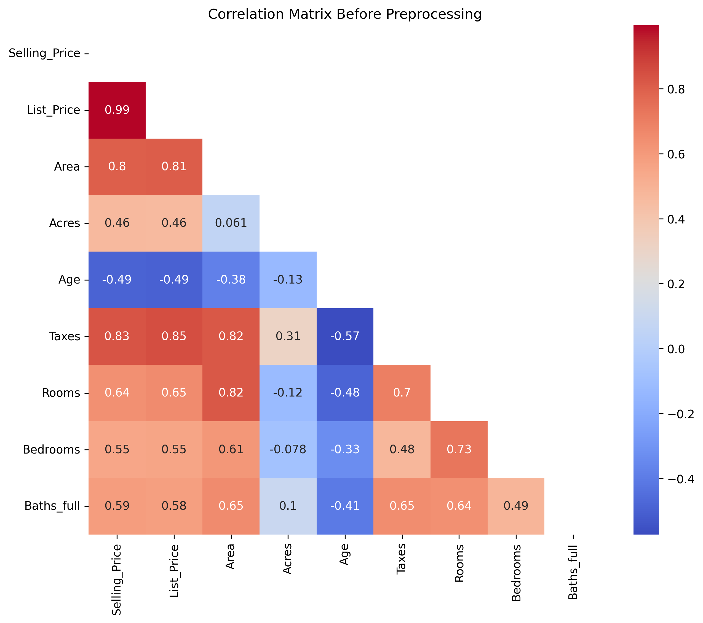
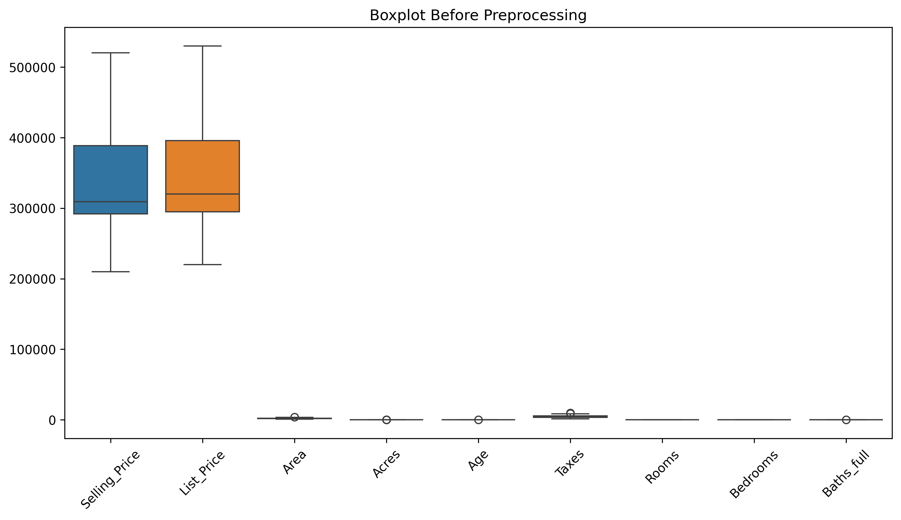
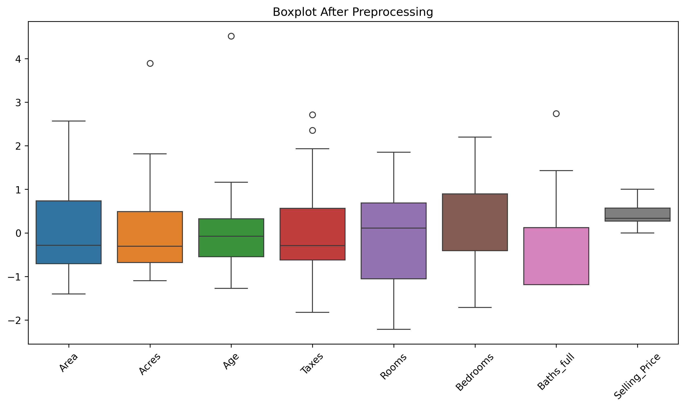
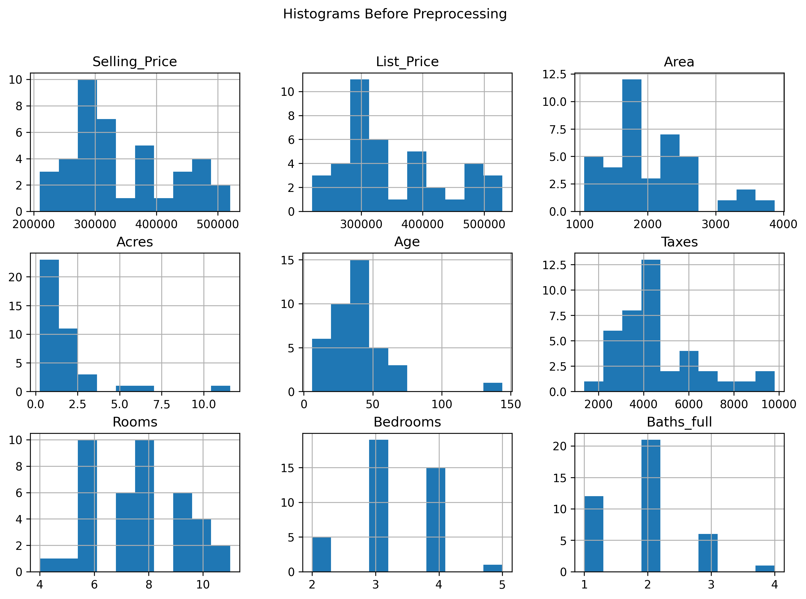
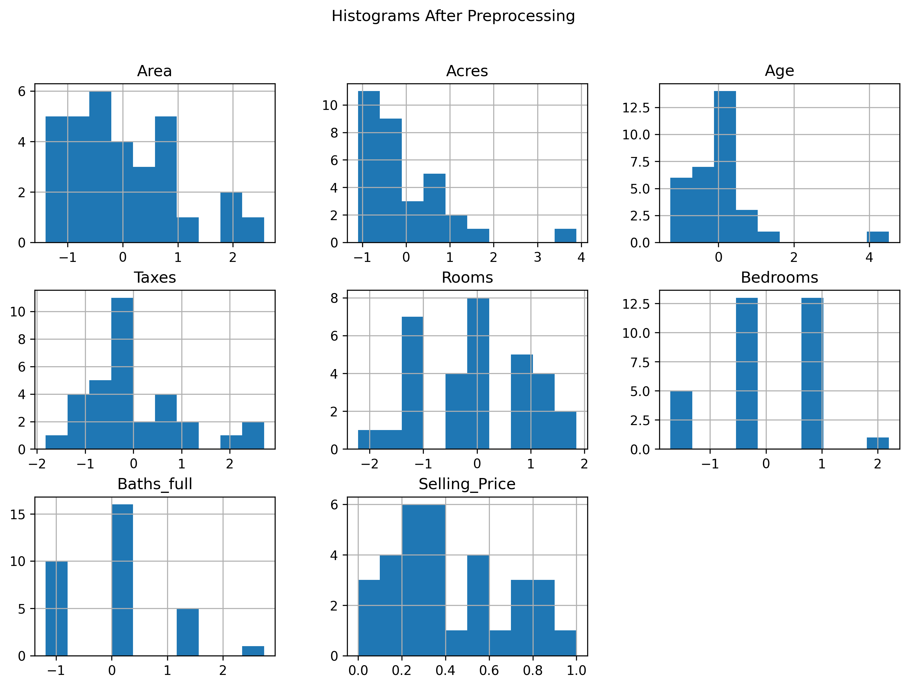
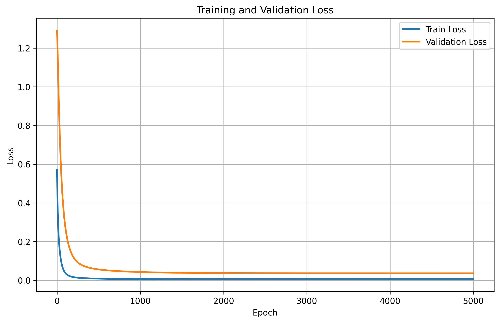
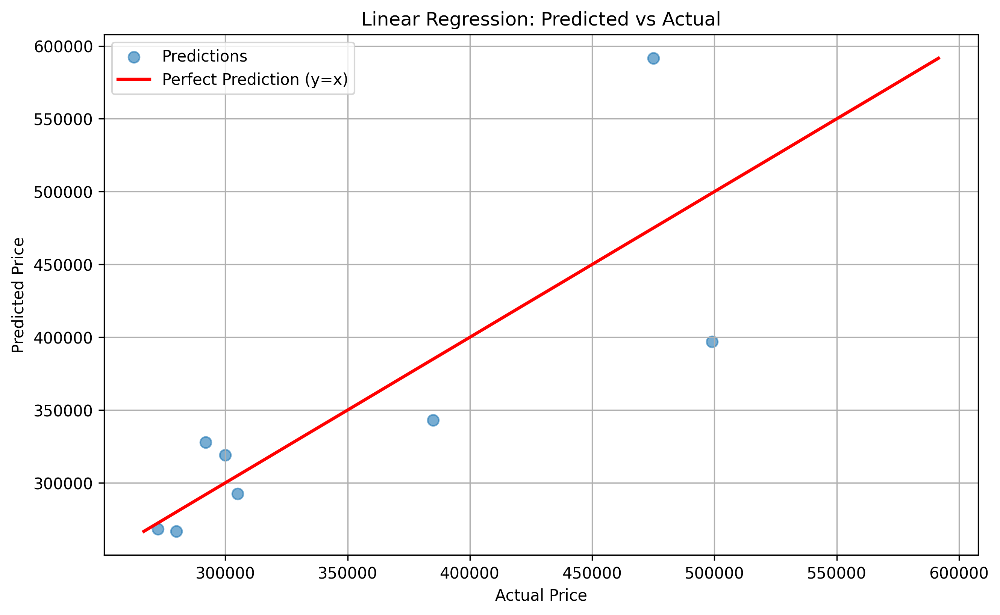

# Weekly Progress Report

* **Author:** Dang Nguyen Hoai - 2001230257
* **Topic:** Lab 02 - Linear Regression for House Price Prediction
* **Date:** Week 02 - May 2026

---

## 1. Exploratory Data Analysis & Preprocessing

The `23_HOMES.csv` dataset contains 40 observations of house sales with 8 input features and a target price (`Selling_Price`). 

### Key EDA Insights & Rationale:
* **Target Leakage:** The correlation matrix reveals a near-perfect correlation ($\approx 0.99$) between `List_Price` and `Selling_Price`. Keeping `List_Price` would allow the model to "cheat" by copying the list price rather than learning the actual structural value of the house. Thus, `List_Price` was dropped.
* **Scale Mismatch & Skewness:** Initial variables vary drastically in scale (e.g., selling prices in hundreds of thousands vs. rooms in single digits) and exhibit non-normal distributions (e.g., `Acres` is heavily right-skewed). Scaling is essential for stable gradient descent.

### Preprocessing Pipeline:
1. **Split:** The dataset was split into **80% training** (32 samples) and **20% validation** (8 samples) using `random_state=42`.
2. **Target Scaling ($y$):** Scaled to the $[0, 1]$ range using **MinMaxScaler**:
   $$y' = \frac{y - \min(y)}{\max(y) - \min(y)}$$
3. **Feature Scaling ($X$):** Normalized to a mean of $0$ and standard deviation of $1$ using **StandardScaler**:
   $$x' = \frac{x - \mu}{\sigma}$$

This pipeline centered the variables and scaled them to comparable ranges (mostly between -3 and 3), ensuring numerical stability:

| Feature Distributions Before Preprocessing | Feature Distributions After Preprocessing |
| :---: | :---: |
|  |  |
|  |  |

---

## 2. Linear Regression Model Architecture

We built a parametric **Linear Regression** model using PyTorch, representing the housing price as a weighted combination of its structural features plus a bias term:
$$\hat{y} = XW + b$$

* **Framework:** PyTorch (`nn.Linear(input_size, 1)`) where `input_size = 7` (representing `Area`, `Acres`, `Age`, `Taxes`, `Rooms`, `Bedrooms`, and `Baths_full`).
* **Loss Function:** Mean Squared Error (MSE), which computes the average squared difference between predictions and actual scaled prices:
  $$\mathcal{L} = \frac{1}{N} \sum_{i=1}^N (y_i - \hat{y}_i)^2$$
* **Optimizer:** Stochastic Gradient Descent (SGD) with a learning rate of $\eta = 0.01$.
* **Early Stopping:** Monitored the validation loss with a patience of $50$ epochs to halt training if overfitting occurred.

---

## 3. Model Training & Loss Performance

The model was trained for the full $5000$ epochs, as validation loss continued to decrease smoothly alongside training loss:
* **Epoch 1:** Train Loss = `0.571725` | Validation Loss = `1.290332`
* **Epoch 5000 (Final):** Train Loss = `0.006264` | Validation Loss = `0.036123`

The loss curves show a steady, continuous convergence without signs of overfitting, proving that Z-score standardization allowed the SGD optimizer to perform highly stable updates.

---

## 4. Validation Results & Predictions Evaluation

To evaluate the predictive performance, we tested the model on the unseen validation dataset (8 samples) and mapped the predictions back to the original USD range using the inverse `MinMaxScaler` transform.

### Predicted vs. Actual House Prices

| Sample # | Actual Price (USD) | Predicted Price (USD) | Difference (USD) | Absolute Error (%) |
| :---: | :---: | :---: | :---: | :---: |
| 1 | \$272,500.00 | \$268,175.03 | -\$4,324.97 | 1.59% |
| 2 | \$280,000.00 | \$266,695.06 | -\$13,304.94 | 4.75% |
| 3 | \$475,000.00 | \$591,600.00 | +\$116,600.00 | 24.55% |
| 4 | \$499,000.00 | \$397,003.69 | -\$101,996.31 | 20.44% |
| 5 | \$305,000.00 | \$292,507.28 | -\$12,492.72 | 4.10% |
| 6 | \$385,000.00 | \$342,941.06 | -\$42,058.94 | 10.92% |
| 7 | \$300,000.00 | \$319,050.72 | +\$19,050.72 | 6.35% |
| 8 | \$292,000.00 | \$327,899.44 | +\$35,899.44 | 12.29% |

### Performance Metrics on Validation Set
* **Mean Absolute Error (MAE):** Represents the average dollar difference between predictions and actual prices:
  $$MAE = \frac{1}{n}\sum_{i=1}^n |y_i - \hat{y}_i| \approx \$43,216.01$$
* **Mean Absolute Percentage Error (MAPE):** The average relative percentage error of the predictions:
  $$MAPE = \frac{1}{n}\sum_{i=1}^n \left| \frac{y_i - \hat{y}_i}{y_i} \right| \times 100\% \approx 10.62\%$$

### Predictions Analysis
For a highly constrained dataset of 40 total samples (with only 32 samples used for training), a **MAPE of 10.62%** is exceptional. As shown in the scatter plot below, the predictions map closely to the perfect prediction line ($y = x$). This demonstrates that despite the extremely small sample size, our model successfully extracted the generalizable linear patterns connecting structural features to market values.

