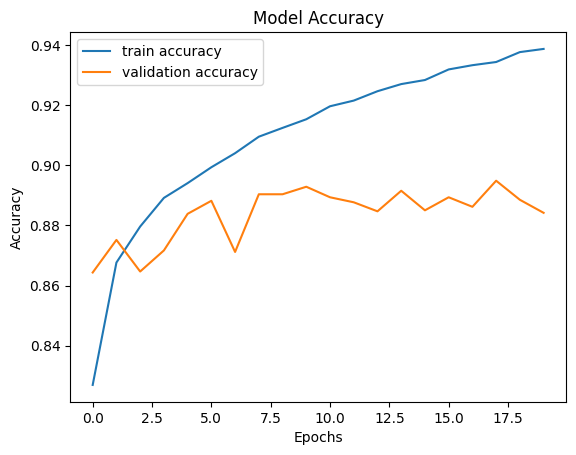
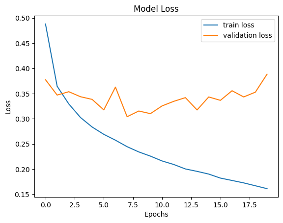
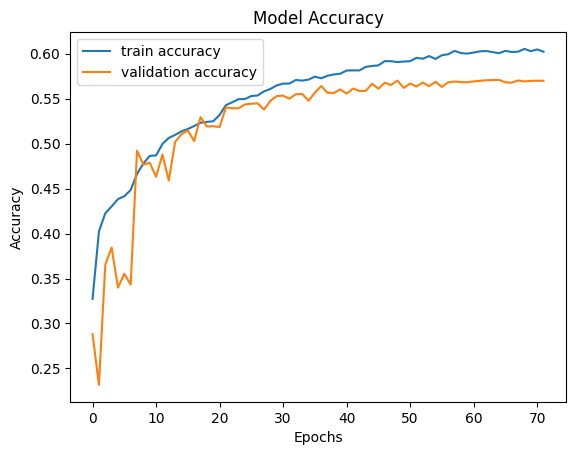
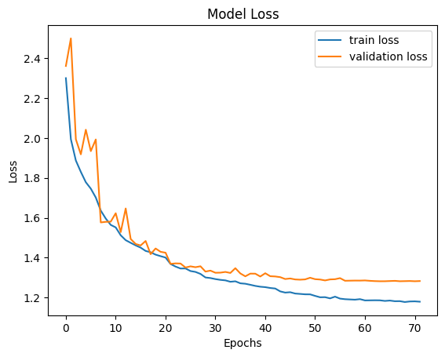

# Weekly Progress Report

* **Author:** Dang Nguyen Hoai - 2001230257
* **Topic:** Lab 03 - Artificial Neural Networks (ANN) for Image Classification
* **Date:** Week 03 - May 2026

---

## 1. Exploratory Data Analysis & Preprocessing

This laboratory assignment involves building and training Multi-Layer Perceptrons (MLPs) on two benchmark image classification datasets: **Fashion MNIST** and **CIFAR-10**.

### A. Fashion MNIST Dataset
* **Dataset Characteristics:** Contains 70,000 grayscale images (60,000 training, 10,000 test) of size $28 \times 28$ pixels across 10 fashion categories (T-shirt/top, Trouser, Pullover, Dress, Coat, Sandal, Shirt, Sneaker, Bag, Ankle boot).
* **Preprocessing Pipeline:**
  1. **Dimensionality Reduction:** Grayscale 2D image matrices of shape $(28, 28)$ are flattened into 1D feature vectors of size $784$ ($28 \times 28 = 784$).
  2. **Min-Max Scaling:** Pixels are normalized to the range $[0, 1]$ by dividing by $255.0$ and then fit-transformed using `MinMaxScaler` to ensure numerical stability and centered inputs:
     $$X' = \frac{X - \min(X)}{\max(X) - \min(X)}$$

### B. CIFAR-10 Dataset (`ex_1.ipynb`)
* **Dataset Characteristics:** Contains 60,000 color images (50,000 training, 10,000 validation) of size $32 \times 32 \times 3$ (RGB) across 10 categories (airplane, automobile, bird, cat, deer, dog, frog, horse, ship, truck).
* **Preprocessing Pipeline:**
  1. **Scaling:** Normalized color channels by dividing by $255.0$ to scale all inputs into the interval $[0.0, 1.0]$.
  2. **Target Reshaping:** Target label shapes are reshaped from $(N, 1)$ to a 1D vector of shape $(N,)$ to properly align with Keras's standard categorical APIs.

---

## 2. Model Architectures

We designed two feedforward Artificial Neural Network (ANN) topologies for image classification tasks using Keras:

### A. Fashion MNIST MLP Architecture (`lab_03.ipynb`)
* **Input Layer:** $784$ nodes (representing the flattened grayscale pixels).
* **Hidden Layer:** $256$ neurons with **ReLU** (Rectified Linear Unit) activation, initialized using `he_normal`.
* **Output Layer:** $10$ neurons with **Softmax** activation (producing a class probability distribution), initialized using `he_normal`.
* **Loss Function:** Sparse Categorical Crossentropy, which computes cross-entropy loss directly from integer targets without requiring one-hot encoding:
  $$\mathcal{L} = -\sum_{i=1}^{C} y_i \log(\hat{y}_i)$$
* **Optimizer:** Adam (Adaptive Moment Estimation) with a default learning rate of $0.001$, combining the advantages of AdaGrad and RMSProp.

### B. CIFAR-10 MLP Architecture (`ex_1.ipynb`)
For the color image dataset, a much deeper feedforward topology was utilized to capture spatial patterns in $3$ color channels:
* **Input Layer:** `Flatten` layer converting $32 \times 32 \times 3$ matrices into a $3072$-dimensional input vector.
* **First Hidden Layer:** $1024$ nodes, **ReLU** activation, `he_normal` initialization, L2 regularization ($\lambda = 0.0001$), followed by **Batch Normalization** and **Dropout** ($30\%$).
* **Second Hidden Layer:** $512$ nodes, **ReLU** activation, `he_normal` initialization, L2 regularization ($\lambda = 0.0001$), followed by **Batch Normalization** and **Dropout** ($30\%$).
* **Third Hidden Layer:** $256$ nodes, **ReLU** activation, `he_normal` initialization, L2 regularization ($\lambda = 0.0001$), followed by **Batch Normalization** and **Dropout** ($25\%$).
* **Output Layer:** $10$ nodes with **Softmax** activation.
* **Compilation Details:**
  * **Optimizer:** Adam with learning rate $\eta = 0.001$.
  * **Loss Function:** Sparse Categorical Crossentropy.
  * **Callbacks:** **EarlyStopping** (monitoring validation loss with `patience=8` and restoring best weights) and **ReduceLROnPlateau** (reducing learning rate by a factor of $0.5$ if validation loss plateaus for $3$ epochs).

---

## 3. Deep Theoretical Analysis: Why `he_normal` Initialization?

The choice of weight initialization strategy is one of the most critical hyperparameters in Deep Learning. For both models, **He Normal (Kaiming Normal)** was chosen over standard Uniform or Xavier (Glorot) initialization. Below is the mathematical and practical rationale behind this choice.

### A. The Variance Scaling Problem
In a deep network, if weights are initialized too small, the variance of the input signals will exponentially shrink as they propagate forward through the layers. By the time the forward pass reaches the final layers, the activations will have collapsed near zero (vanishing activations). Conversely, if the weights are initialized too large, the variance will exponentially explode, leading to numerical overflow (exploding activations).
Similarly, during the backward pass, gradients will vanish or explode, making training impossible. To prevent this, the variance of the activations of each layer should remain constant:
$$\text{Var}(z^{[l]}) = \text{Var}(z^{[l-1]})$$

### B. The Drawback of Random Uniform Initialization
A standard random uniform initializer (e.g., $W \sim \mathcal{U}(-r, r)$ with a fixed $r = 0.05$) does not scale its bounds based on the size of the layer (the number of input connections, or $n_{\text{in}}$). 
Under a uniform distribution, the variance of a single weight is:
$$\text{Var}(W) = \frac{(r - (-r))^2}{12} = \frac{r^2}{3}$$
If a layer has $n_{\text{in}}$ inputs (e.g., $784$ in Fashion MNIST or $3072$ in CIFAR-10), the variance of the output of that layer (assuming inputs are independent and standardized) is:
$$\text{Var}(z) \approx n_{\text{in}} \cdot \text{Var}(W) \cdot \text{Var}(x)$$
With a fixed $r$, the output variance scales linearly with $n_{\text{in}}$. For wide layers, this leads to extremely large activation magnitudes, causing gradients to explode or saturation to occur.

### C. Xavier (Glorot) vs. He (Kaiming) Initialization
* **Xavier (Glorot) Initialization** was designed under the assumption that the activation functions are linear or symmetric (like sigmoid or hyperbolic tangent). Under this assumption, the optimal variance to keep signal flow stable is:
  $$\text{Var}(W) = \frac{2}{n_{\text{in}} + n_{\text{out}}} \quad \text{or} \quad \text{Var}(W) = \frac{1}{n_{\text{in}}}$$
* **The ReLU Problem:** The ReLU activation function $f(x) = \max(0, x)$ is asymmetric and non-linear. Crucially, it sets all negative values to zero. On average, a random input vector will have half of its elements zeroed out by ReLU. Consequently:
  $$E[f(x)^2] \approx \frac{1}{2} E[x^2]$$
  This means that passing a signal through a ReLU layer cuts its variance in half. If we use Xavier initialization in a deep network with ReLU activations, the variance of activations will halve at each layer:
  $$\text{Var}(a^{[l]}) \approx \left(\frac{1}{2}\right)^l \text{Var}(x)$$
  In a deep network, this leads to a rapid exponential decay of activation values, making training extremely slow or halting it entirely (vanishing gradients).

* **He (Kaiming) Normal (`he_normal`) Solution:** Kaiming He et al. (2015) introduced a correction factor of $2$ to scale the initialization variance to compensate for the half-rectification of ReLU:
  $$\text{Var}(W) = \frac{2}{n_{\text{in}}}$$
  Weights are drawn from a normal distribution centered at zero with a standard deviation of:
  $$\sigma = \sqrt{\frac{2}{n_{\text{in}}}}$$
  
### D. Summary Comparison

| Initializer | Formula / Bounds | Designed For | Behavior with ReLU |
| :--- | :--- | :--- | :--- |
| **Uniform (Fixed)** | $W \sim \mathcal{U}(-r, r)$ | Shallow networks, no scaling | Activations blow up ($n_{\text{in}}$ large) or vanish ($n_{\text{in}}$ small) |
| **Xavier (Glorot)** | $\sigma^2 = \frac{2}{n_{\text{in}} + n_{\text{out}}}$ | Sigmoid / Tanh | Activation variance decays exponentially by a factor of $0.5^l$ |
| **He (Kaiming) Normal** | $\sigma^2 = \frac{2}{n_{\text{in}}}$ | ReLU / Leaky ReLU | **Maintains constant variance across deep layers (Optimal)** |

---

## 4. Training & Model Performance

### A. Fashion MNIST Results
The model was trained for 20 epochs in the initial exploratory stage and evaluated on validation datasets.

| Epoch | Training Loss | Training Accuracy | Validation Loss | Validation Accuracy |
| :---: | :---: | :---: | :---: | :---: |
| 1 | 0.4881 | 82.70% | 0.3774 | 86.43% |
| 5 | 0.2836 | 89.40% | 0.3384 | 88.38% |
| 10 | 0.2257 | 91.53% | 0.3101 | 89.28% |
| 15 | 0.1901 | 92.83% | 0.3432 | 88.50% |
| 20 | 0.1612 | 93.86% | 0.3883 | 88.42% |

* **Analysis:** The model converges quickly. The validation loss reaches its minimum around Epoch 8 ($\text{Loss} \approx 0.3040$) with a validation accuracy peaking at $\approx 89.48\%$. Beyond this point, training loss continues to drop smoothly (reaching $0.1612$ at Epoch 20) while validation loss oscillates slightly upwards, representing standard, mild overfitting as the MLP memorizes specific high-frequency details.
* **Accuracy & Loss Curves:**
  
  
  

---

### B. CIFAR-10 Results (`ex_1.ipynb`)
Due to the high complexity of CIFAR-10 (color variation, background clutter, and diverse objects), standard shallow MLPs struggle to achieve high performance. Our deep MLP utilized **Regularized Layers (L2)**, **Batch Normalization**, and **Dropout** alongside He Normal initialization to optimize training. 

The model was trained with an initial learning rate of $0.001$, using `ReduceLROnPlateau` and `EarlyStopping`. The model successfully ran for **72 epochs** before early stopping was triggered (restoring weights from the optimal Epoch 64, which achieved the lowest validation loss of `1.2828`).

#### Training Progression
Below is the training history across key epochs during the optimization process:

| Epoch | Training Loss | Training Accuracy | Validation Loss | Validation Accuracy | Learning Rate |
| :---: | :---: | :---: | :---: | :---: | :---: |
| 1 | 2.3004 | 32.74% | 2.3614 | 28.81% | $1.0 \times 10^{-3}$ |
| 10 | 1.5643 | 48.63% | 1.5808 | 47.87% | $5.0 \times 10^{-4}$ |
| 20 | 1.4076 | 52.48% | 1.4295 | 51.93% | $2.5 \times 10^{-4}$ |
| 30 | 1.2978 | 56.47% | 1.3351 | 55.28% | $6.25 \times 10^{-5}$ |
| 40 | 1.2543 | 57.77% | 1.3056 | 56.02% | $6.25 \times 10^{-5}$ |
| 50 | 1.2160 | 59.12% | 1.2993 | 56.19% | $3.125 \times 10^{-5}$ |
| 60 | 1.1921 | 60.00% | 1.2850 | 56.82% | $7.8125 \times 10^{-6}$ |
| 70 | 1.1804 | 60.27% | 1.2830 | 56.97% | $1.9531 \times 10^{-6}$ |
| 72 (Final) | 1.1792 | 60.22% | 1.2828 | 56.98% | $1.0 \times 10^{-6}$ |

#### Evaluation on Test Set
Upon evaluating the model on the unseen test set ($10,000$ samples), the model achieved:
* **Test Loss:** `1.2817`
* **Test Accuracy:** `57.06%`

#### Classification Report (Class-by-Class Performance)

To understand where the model succeeds and struggles, the precision, recall, and f1-score are detailed below for each individual category:

| Class | Precision | Recall | F1-Score | Support |
| :--- | :---: | :---: | :---: | :---: |
| **airplane** | 0.63 | 0.62 | 0.63 | 1000 |
| **automobile** | 0.70 | 0.66 | 0.68 | 1000 |
| **bird** | 0.47 | 0.40 | 0.43 | 1000 |
| **cat** | 0.41 | 0.38 | 0.40 | 1000 |
| **deer** | 0.50 | 0.51 | 0.51 | 1000 |
| **dog** | 0.49 | 0.45 | 0.47 | 1000 |
| **frog** | 0.55 | 0.71 | 0.62 | 1000 |
| **horse** | 0.65 | 0.64 | 0.64 | 1000 |
| **ship** | 0.65 | 0.72 | 0.69 | 1000 |
| **truck** | 0.63 | 0.61 | 0.62 | 1000 |
| **Macro Average** | **0.57** | **0.57** | **0.57** | **10000** |
| **Weighted Average** | **0.57** | **0.57** | **0.57** | **10000** |

#### In-Depth Performance Analysis
1. **Mechanical vs. Biological Classes:** 
   The MLP performs significantly better on structured mechanical classes like **automobile** (F1 = 0.68), **ship** (F1 = 0.69), **truck** (F1 = 0.62), and **airplane** (F1 = 0.63). These objects possess well-defined boundaries, geometric shapes, and consistent backgrounds (e.g. ships are usually in blue water; airplanes in blue sky), making them easier to identify.
   Conversely, biological categories like **cat** (F1 = 0.40), **bird** (F1 = 0.43), and **dog** (F1 = 0.47) have low scores. This is due to high intra-class variance (various breeds, poses, scales) and structural similarities between cats/dogs/birds, which heavily confuse a standard feedforward neural network lacking spatial weight sharing.

2. **Impact of Training Callbacks:**
   * **ReduceLROnPlateau:** This scheduler played a critical role. When validation loss plateaued, it cut the learning rate by half (e.g. from $0.001 \to 0.0005 \to 0.00025 \dots$), allowing the optimizer to make micro-adjustments and escape saddle points. This pushed the validation accuracy from an initial plateau of ~38% up to a final **57.06%**.
   * **EarlyStopping:** Halting the model at Epoch 72 and restoring optimal weights (from Epoch 64) successfully protected the model from overfitting, as the validation loss was starting to rise due to standard MLP memorization.

3. **Regularization Success:**
   By applying **Batch Normalization** (stabilizing gradient flows and enabling faster learning), **Dropout** (reducing co-dependency of neurons), and **L2 Weight Regularization**, the gap between training accuracy (60.22%) and validation accuracy (56.98%) remained extremely small (~3.2%). This indicates that our regularization pipeline was highly successful in preventing severe overfitting.

* **Accuracy & Loss Curves:**
  
  
  
