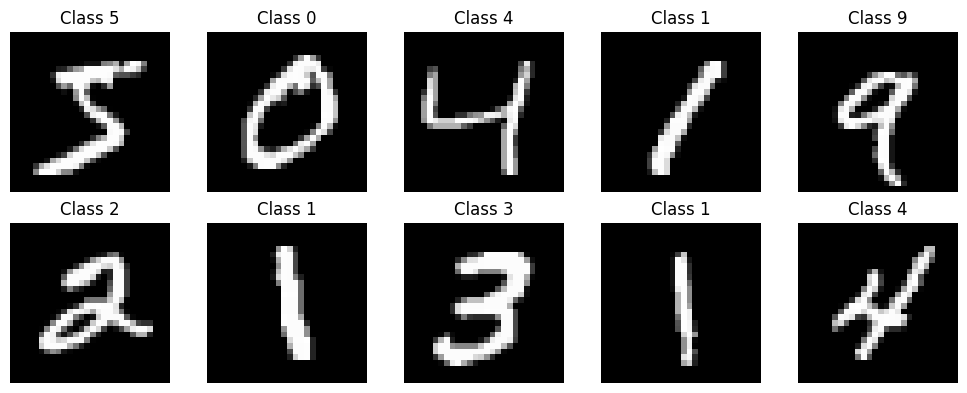
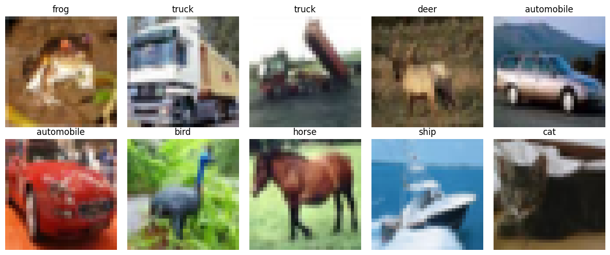
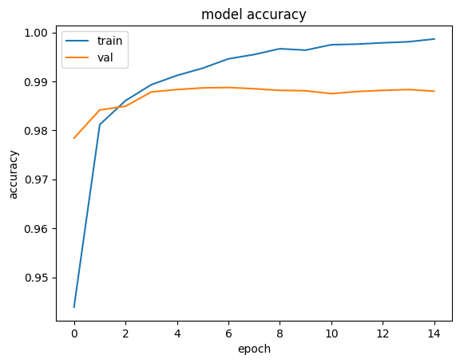
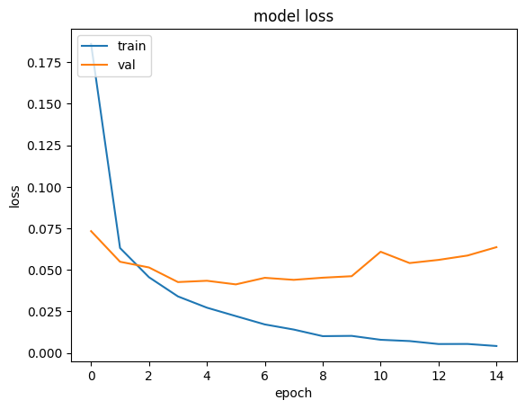
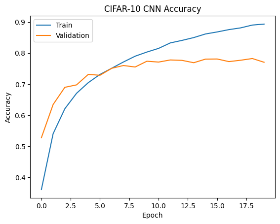
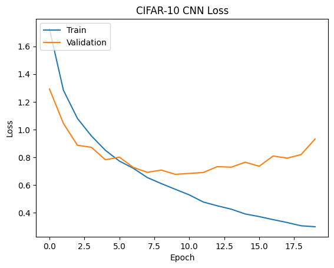
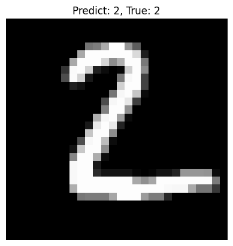
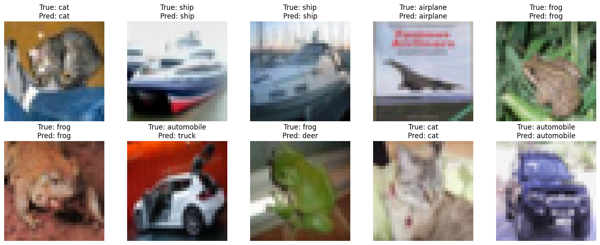

# Weekly Progress Report

* **Author:** Dang Nguyen Hoai - 2001230257
* **Topic:** Lab 04 - Convolutional Neural Networks (CNN) for Image Classification
* **Date:** Week 04 - June 2026

---

## 1. Exploratory Data Analysis & Preprocessing

This laboratory assignment involves building and training Convolutional Neural Networks (CNNs) on two benchmark image classification datasets: **MNIST** and **CIFAR-10**.

### A. MNIST Dataset (`lab_04.ipynb`)
* **Dataset Characteristics:** Contains 70,000 grayscale images (60,000 training, 10,000 test) of size $28 \times 28$ pixels across 10 handwritten digit classes (0–9).
* **Preprocessing Pipeline:**
  1. **Pixel Normalization:** Pixel values are scaled from $[0, 255]$ to $[0.0, 1.0]$ by dividing by $255.0$.
  2. **Channel Expansion:** Image shape is reshaped from $(N, 28, 28)$ to $(N, 28, 28, 1)$ to add a channel dimension required by CNNs.
  3. **One-Hot Encoding:** Labels are converted to one-hot vectors of shape $(N, 10)$ using `keras.utils.to_categorical`.

| Shape | Training | Test |
| :--- | :---: | :---: |
| **Before reshape** | `(60000, 28, 28)` | `(10000, 28, 28)` |
| **After reshape** | `(60000, 28, 28, 1)` | `(10000, 28, 28, 1)` |
| **Labels (one-hot)** | `(60000, 10)` | `(10000, 10)` |

**Visualization of first 10 training images:**

> *(10 ảnh đầu tiên từ tập huấn luyện MNIST, mỗi ảnh có nhãn từ 0–9)*

---

### B. CIFAR-10 Dataset (`ex_01.ipynb`)
* **Dataset Characteristics:** Contains 60,000 color images (50,000 training, 10,000 test) of size $32 \times 32 \times 3$ (RGB) across 10 object categories: airplane, automobile, bird, cat, deer, dog, frog, horse, ship, truck.
* **Preprocessing Pipeline:**
  1. **Pixel Normalization:** Scaled from $[0, 255]$ to $[0.0, 1.0]$ by dividing by $255.0$.
  2. **One-Hot Encoding:** Labels converted to one-hot vectors of shape $(N, 10)$.

| Shape | Training | Test |
| :--- | :---: | :---: |
| **Original input** | `(50000, 32, 32, 3)` | `(10000, 32, 32, 3)` |
| **After normalization** | `(50000, 32, 32, 3)` | `(10000, 32, 32, 3)` |
| **Labels (one-hot)** | `(50000, 10)` | `(10000, 10)` |

**Visualization of first 10 training images:**

> *(10 ảnh đầu tiên từ tập huấn luyện CIFAR-10, hiển thị cùng tên lớp)*

---

## 2. Model Architectures

### A. MNIST CNN Architecture (`lab_04.ipynb`)

A simple two-block CNN using `Conv2D` + `MaxPooling2D`, followed by a `Flatten` and a `Dense` output layer:

* **Block 1:** `Conv2D(32, kernel=(3,3), ReLU)` → `MaxPooling2D(pool=(2,2))`
* **Block 2:** `Conv2D(64, kernel=(3,3), ReLU)` → `MaxPooling2D(pool=(2,2))`
* **Head:** `Flatten` → `Dense(10, Softmax)`

| Layer (type) | Output Shape | Param # |
| :--- | :---: | ---: |
| `conv2d` (Conv2D) | (None, 26, 26, 32) | 320 |
| `max_pooling2d` (MaxPooling2D) | (None, 13, 13, 32) | 0 |
| `conv2d_1` (Conv2D) | (None, 11, 11, 64) | 18,496 |
| `max_pooling2d_1` (MaxPooling2D) | (None, 5, 5, 64) | 0 |
| `flatten` (Flatten) | (None, 1600) | 0 |
| `dense` (Dense) | (None, 10) | 16,010 |
| **Total params** | | **34,826** (136.04 KB) |
| **Trainable params** | | **34,826** (136.04 KB) |
| **Non-trainable params** | | **0** (0.00 B) |

* **Loss Function:** Categorical Crossentropy
* **Optimizer:** Adam
* **Metrics:** Accuracy

---

### B. CIFAR-10 CNN Architecture (`ex_01.ipynb`)

A deeper three-block CNN with `Conv2D` blocks (including same-padding), `Flatten`, a dense hidden layer with `Dropout`, and a Softmax output:

* **Block 1:** `Conv2D(32, kernel=(3,3), ReLU, same)` × 2 → `MaxPooling2D(pool=(2,2))`
* **Block 2:** `Conv2D(64, kernel=(3,3), ReLU, same)` × 2 → `MaxPooling2D(pool=(2,2))`
* **Block 3:** `Conv2D(128, kernel=(3,3), ReLU, same)` → `MaxPooling2D(pool=(2,2))`
* **Head:** `Flatten` → `Dense(128, ReLU)` → `Dropout(0.5)` → `Dense(10, Softmax)`

| Layer (type) | Output Shape | Param # |
| :--- | :---: | ---: |
| `conv2d_5` (Conv2D) | (None, 32, 32, 32) | 896 |
| `conv2d_6` (Conv2D) | (None, 32, 32, 32) | 9,248 |
| `max_pooling2d_3` (MaxPooling2D) | (None, 16, 16, 32) | 0 |
| `conv2d_7` (Conv2D) | (None, 16, 16, 64) | 18,496 |
| `conv2d_8` (Conv2D) | (None, 16, 16, 64) | 36,928 |
| `max_pooling2d_4` (MaxPooling2D) | (None, 8, 8, 64) | 0 |
| `conv2d_9` (Conv2D) | (None, 8, 8, 128) | 73,856 |
| `max_pooling2d_5` (MaxPooling2D) | (None, 4, 4, 128) | 0 |
| `flatten_1` (Flatten) | (None, 2048) | 0 |
| `dense_2` (Dense) | (None, 128) | 262,272 |
| `dropout_1` (Dropout) | (None, 128) | 0 |
| `dense_3` (Dense) | (None, 10) | 1,290 |
| **Total params** | | **402,986** (1.54 MB) |
| **Trainable params** | | **402,986** (1.54 MB) |
| **Non-trainable params** | | **0** (0.00 B) |

* **Loss Function:** Categorical Crossentropy
* **Optimizer:** Adam
* **Metrics:** Accuracy

---

## 3. Training & Model Performance

### A. MNIST Results (`lab_04.ipynb`)

The model was trained for **15 epochs** with a validation split of 20%.

| Epoch | Training Accuracy | Validation Accuracy |
| :---: | :---: | :---: |
| 1 | 94.55% | 98.03% |
| 5 | ~98.5% | ~98.9% |
| 10 | ~99.0% | ~98.9% |
| 15 (Final) | ~99.8% | ~98.8% |

* **Analysis:** The CNN converges extremely fast on MNIST. By Epoch 1, the model already achieves a validation accuracy of $\approx 98\%$. The validation accuracy peaks around Epoch 4–5 at $\approx 98.9\%$ and remains stable through all 15 epochs. The gap between training and validation accuracy remains very small ($< 1\%$), confirming no overfitting on this simple dataset.

**Accuracy & Loss Curves:**

---

### B. CIFAR-10 Results (`ex_01.ipynb`)

The model was trained for 20 epochs with a validation split of 20% and a batch size of 64.

| Epoch | Training Loss | Training Accuracy | Validation Loss | Validation Accuracy |
| :---: | :---: | :---: | :---: | :---: |
| 1 | 1.7267 | 36.08% | 1.2924 | 52.76% |
| 5 | 0.8501 | 70.47% | 0.7820 | 73.13% |
| 10 | 0.5689 | 80.33% | 0.6766 | 77.37% |
| 15 | 0.3908 | 86.15% | 0.7642 | 78.05% |
| 20 (Final) | 0.2987 | 89.33% | 0.9316 | 77.04% |

* **Analysis:** The CNN for CIFAR-10 shows a strong improvement over the course of training. However, after around Epoch 10, validation accuracy plateaus around $77\%$–$78\%$ while training accuracy continues to rise, indicating the onset of overfitting. By Epoch 20, training accuracy reaches $89.33\%$ versus a validation accuracy of $77.04\%$, a gap of $\approx 12.3\%$. The addition of Dropout ($50\%$) helps mitigate, but does not fully prevent, overfitting on this more complex dataset.

**Accuracy & Loss Curves:**

---

## 4. Prediction Sample

### A. MNIST Prediction (`lab_04.ipynb`)

A sample prediction using the trained MNIST model:

> *Predict: **2** | True: **2** — Mô hình dự đoán chính xác chữ số viết tay từ tập MNIST.*

---

### B. CIFAR-10 Prediction (`ex_01.ipynb`)

A sample of 10 predictions using the trained CIFAR-10 model:

> *Mô hình dự đoán đúng hầu hết các lớp rõ ràng (cat, ship, airplane, frog...). Một số nhầm lẫn xảy ra giữa các lớp gần nhau về ngoại hình (automobile → truck, frog → deer).*
